## Analytical Queries & Visualizations

### 1. Top 10 played songs
```sql
SELECT s.title AS song_name, COUNT(sp.song_id) AS play_count
FROM songplays_fact sp
JOIN songs_dim s ON sp.song_id = s.song_id
GROUP BY s.song_id, s.title
ORDER BY play_count DESC
LIMIT 10;
```
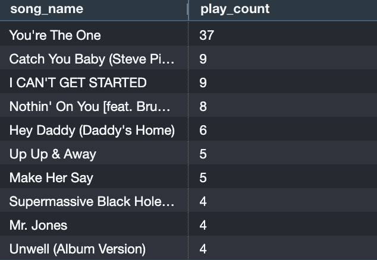
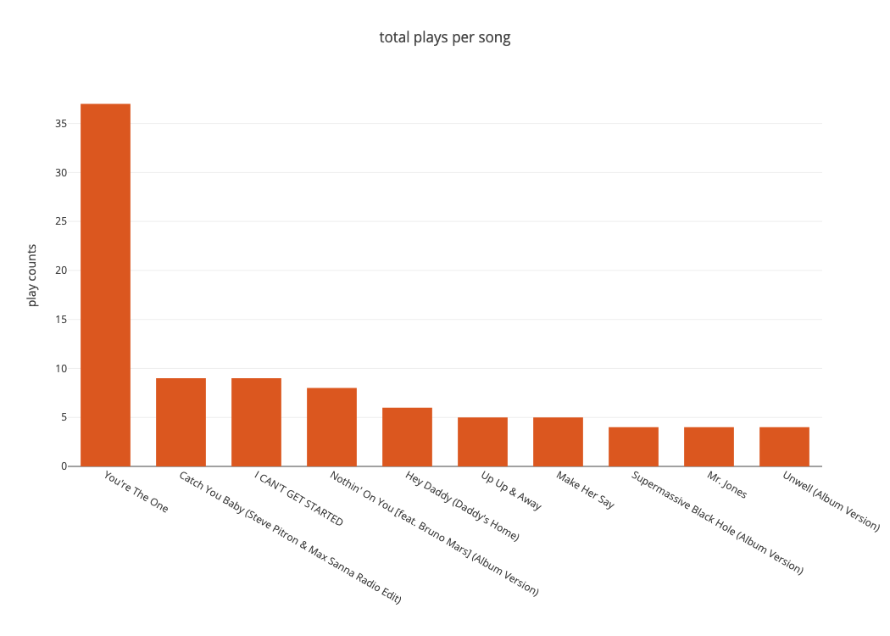

### 2. Top 10 song plays per user
```sql
SELECT user_id, COUNT(*) AS play_count
FROM songplays_fact
GROUP BY user_id
ORDER BY play_count DESC
LIMIT 10;
```
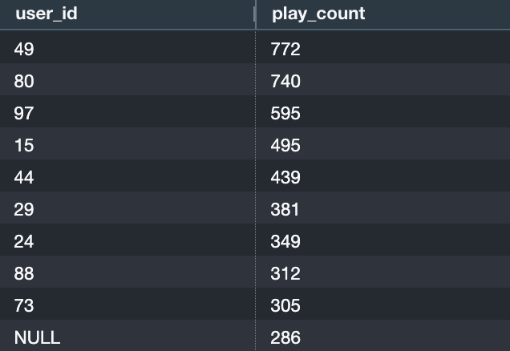

### 3. Retrieve user info of the top 10 song plays per user
```sql
SELECT u.user_id, u.first_name, u.last_name, COUNT(sp.songplay_id) AS play_count
FROM songplays_fact sp
JOIN users_dim u ON sp.user_id = u.user_id
GROUP BY u.user_id, u.first_name, u.last_name
ORDER BY play_count DESC
LIMIT 10;
```
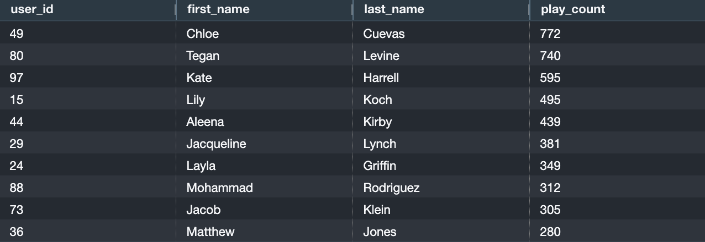

### 4. Daily song plays within a date range
```sql
SELECT DATE(sf.start_time) AS play_date, COUNT(*) AS daily_plays
FROM songplays_fact sf
INNER JOIN songs_dim s ON sf.song_id = s.song_id
INNER JOIN artists_dim a ON s.artist_id = a.artist_id
WHERE start_time >= '2018-11-01 00:00:00' AND start_time <= '2018-11-10 23:59:59'
GROUP BY play_date
ORDER BY play_date;
```
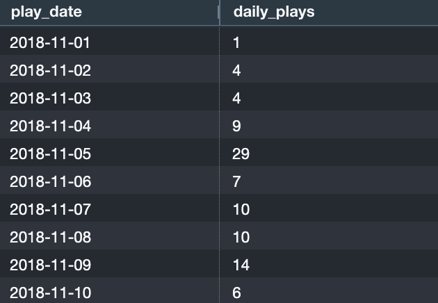

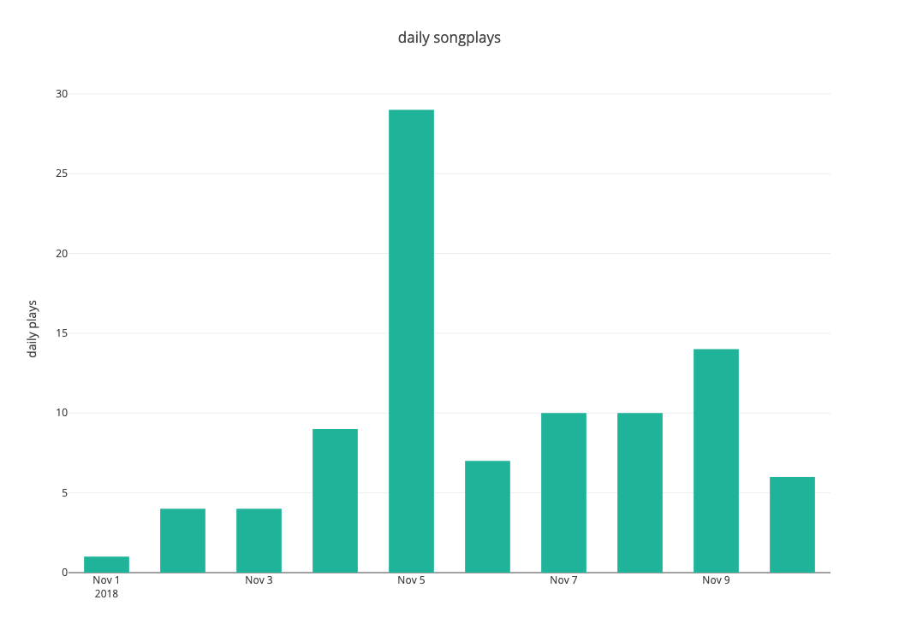

### 5. Unique users per subscription level
```sql
SELECT level, COUNT(DISTINCT user_id) AS unique_users
FROM users_dim
GROUP BY level;
```
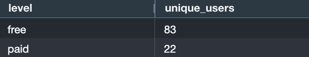

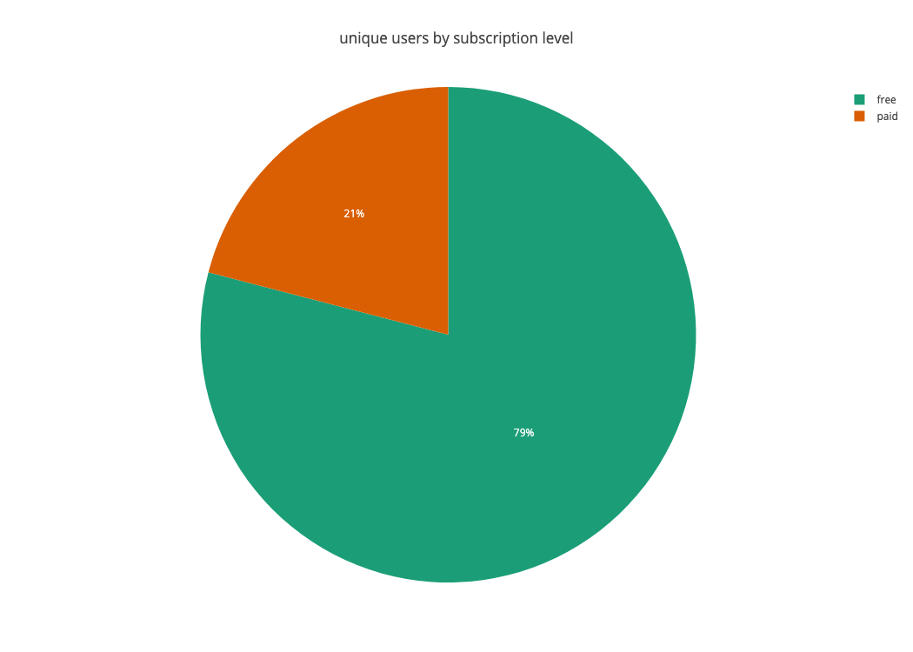

### 6. Top paid listeners
```sql
SELECT COUNT(sp.songplay_id) AS play_counts, u.user_id, u.first_name, u.last_name
FROM songplays_fact sp
JOIN users_dim u ON sp.user_id = u.user_id
WHERE u.level = 'paid'
GROUP BY u.user_id, u.first_name, u.last_name
ORDER BY play_counts DESC;
```
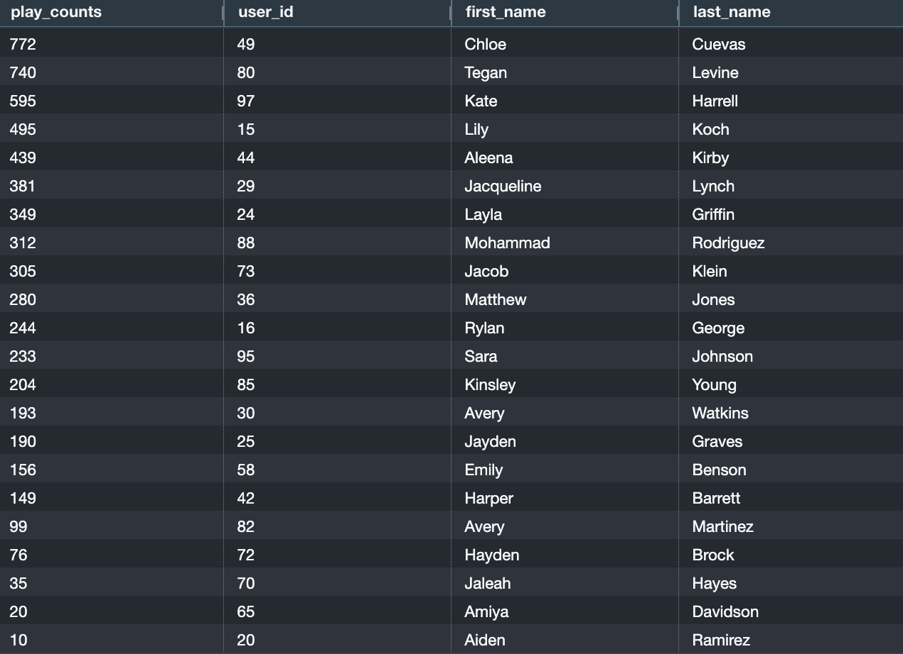

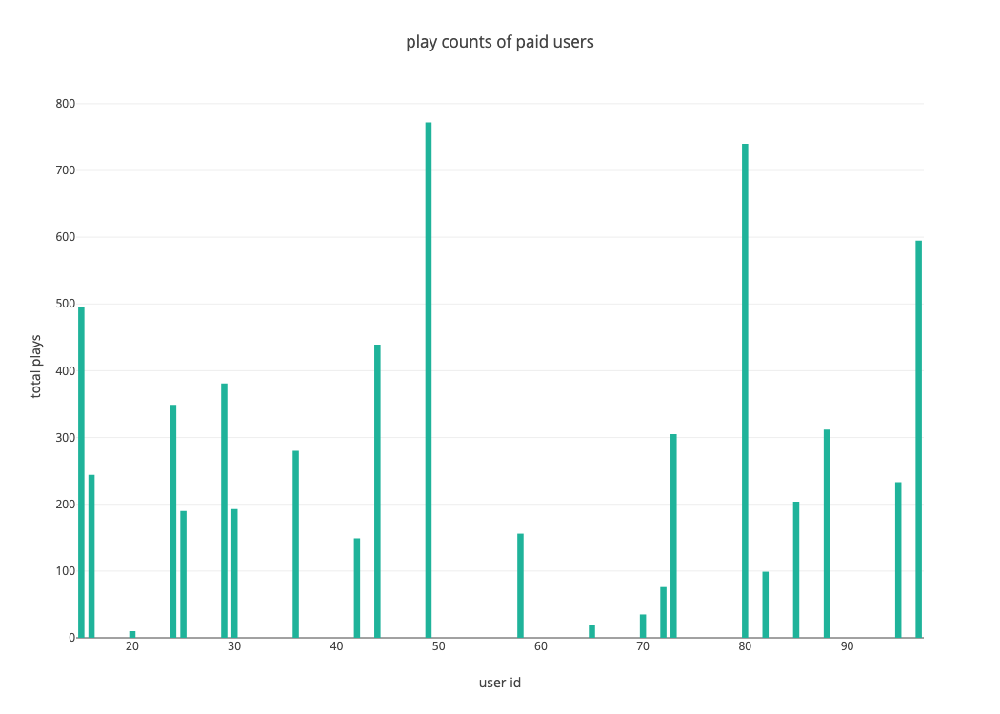

### 7. Unique users who played at least one song
```sql
SELECT COUNT(DISTINCT user_id) AS unique_users
FROM songplays_fact;
```
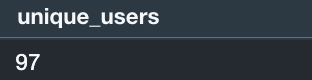

